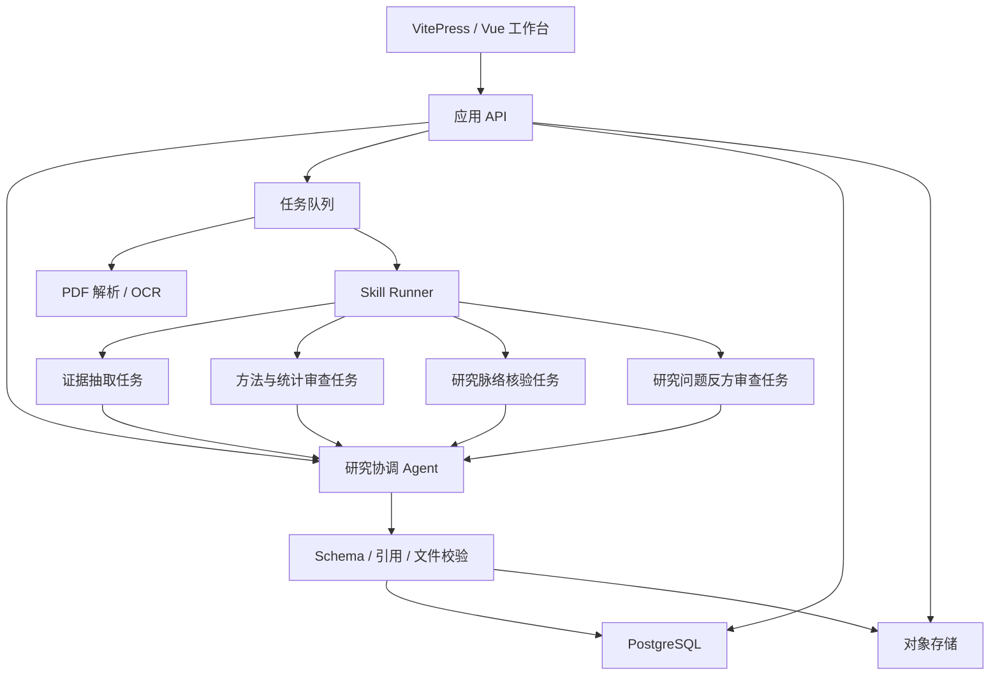
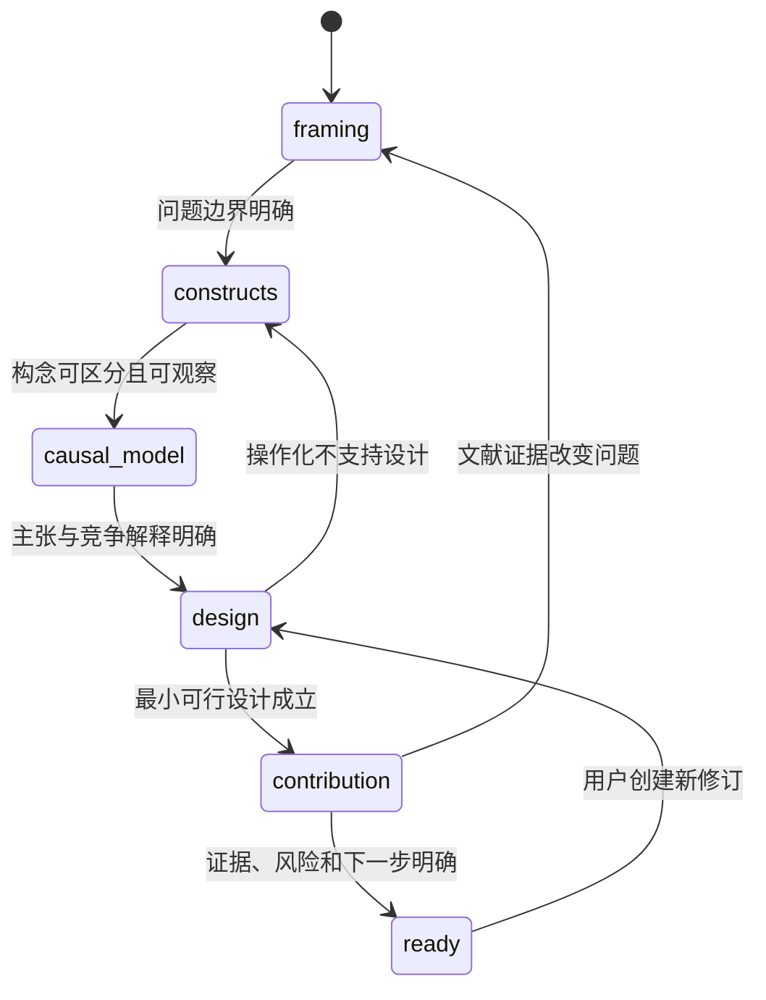

# AI 研究工作台：Agent / Sub-agent 架构设计

## 1. 结论

采用**一个面向用户的协调 Agent + 按需启用的后台专家任务**，而不是让多个 Agent 同时与用户对话。

- 论文精读：适合并行。正文提取完成后，证据抽取、方法审查和研究脉络核验可以并行执行。
- 研究问题打磨：不适合每轮并行。连续追问依赖共同语境，多 Agent 容易重复提问、意见冲突、增加延迟。只在形成初步模型后调用“证据检索”和“反方审查”。
- 报告编译、JSON 校验、文件哈希、去重和归档应由确定性代码完成，不交给 Agent 自由发挥。

这里的 Agent 是网站后端的应用级编排角色，不依赖某个聊天产品是否暴露原生 sub-agent API。模型供应商或执行框架可以替换，业务状态和输出契约保持不变。

## 2. 总体结构



## 3. 设计原则

### 单一对话出口

只有协调 Agent 可以向用户发问或给最终判断。Sub-agent 只返回结构化结果，不能直接修改会话状态或给用户发消息。

### 共享事实，不共享整段对话

Sub-agent 接收最小任务包：论文片段、页码、当前研究蓝图、待审问题和输出 schema。避免把整个聊天历史重复发送给每个任务，降低成本并减少提示污染。

### 证据优先的合并

协调 Agent 合并结果时遵守：

1. 带页码的原文证据优先于无定位摘要；
2. 原始论文和权威来源优先于二手转述；
3. Sub-agent 冲突时不做多数投票，而是列出冲突及依据；
4. 无法消解的冲突进入 `needs_review`，不静默覆盖。

### 版本可复现

每次运行记录 skill 版本、模型标识、参数、输入文件哈希、检索来源、输出 schema 版本和父运行。报告重新生成时保留旧版本。

## 4. 论文精读编排

### 阶段 A：确定性预处理

1. 上传校验：格式、大小、恶意文件扫描、用户权限。
2. 计算 SHA-256，用 DOI + 文件哈希去重。
3. 提取文本、页码映射、图片和表格；必要时 OCR。
4. 生成可引用的块：`chunk_id`, `page_start`, `page_end`, `section`, `text`。
5. 质量门：缺页、乱码或 OCR 置信度不足时，先标记 partial，不能继续生成“完整报告”。

### 阶段 B：条件并行任务

| 任务 | 输入 | 输出 | 何时启用 |
|---|---|---|---|
| 证据抽取 | 全文块与题录 | 研究卡片、关键主张、页码台账 | 全文 review 必需 |
| 方法审查 | Method/Results/附录与证据卡片 | 设计判断、统计矛盾、因果边界 | 实证、质性、元分析按类型启用 |
| 脉络核验 | 理论名、参考文献种子 | 经核验的源头/里程碑来源 | 用户要研究脉络或拓展时启用 |
| 图表核对 | 表图页与正文结果 | 图表-正文一致性问题 | 复杂表图或抽取异常时启用 |

不要默认启动所有任务。摘要级速览只运行轻量抽取；没有外部检索权限时跳过脉络核验，并降低对应结论状态。

### 阶段 C：协调与编译

协调 Agent 读取所有结构化任务结果，生成 `review.md` 和 `review.json`。确定性校验器检查：

- JSON schema；
- 论文身份和研究数量一致；
- 每个关键 claim 的 `claim_id` 可解析；
- 页码在 PDF 范围内；
- Markdown 与 JSON 的结论方向一致；
- DOI、URL 和外部来源格式；
- partial 报告没有被标成 complete。

### 失败策略

- 单个可选任务失败：继续生成 partial 报告，明确缺失模块。
- 证据抽取失败：停止全文报告，提供可诊断错误和重试入口。
- 模型输出 schema 错误：最多做一次结构修复；再次失败则保留原始运行日志并标记 failed。
- 用户取消：队列任务进入 cancelled，已上传文件按隐私策略保留或删除。

## 5. 研究问题打磨编排

### 主会话状态机



状态可以回退，不能强迫线性通关。每一轮只提交一项主要决策，并保存完整 revision。

### 按需专家任务

| Sub-agent | 触发点 | 作用 | 不应做什么 |
|---|---|---|---|
| 文献检索 | 用户要求核验 gap，或进入 contribution | 找支持、冲突和相邻构念证据 | 把“没搜到”写成“没有研究” |
| 构念审查 | 两个构念边界模糊或测量争议大 | 比较定义、测量和适用人群 | 替用户直接选唯一量表 |
| 方法反方 | 初步设计形成后 | 提出最强替代解释和识别风险 | 每轮都否定、拖慢早期构思 |
| 可行性检查 | 涉及昂贵设备、特殊人群或长周期 | 估算资源约束与 Plan B | 代替伦理审查或机构审批 |

协调 Agent 将专家结果转成一个清楚的问题或 2–3 个有取舍的方案，而不是把多份长报告扔给用户。

## 6. Skill Runner

Skill 是版本化的行为配置，不是前端代码。Runner 负责：

- 读取 `SKILL.md` 和当前任务需要的 references；
- 注入应用约束、当前状态和允许使用的工具；
- 强制结构化输出 schema；
- 限制最大步骤、超时、成本和重试次数；
- 记录运行事件与 token/时长；
- 隔离用户文件中的提示词注入。

建议为每个发布版本保存不可变快照，例如：

```text
skill_versions/
  psychology-paper-review/3.0.0/
  psych-idea-refiner/3.0.0/
```

开发中的 skill 可以从 Git 仓库加载；生产环境只运行已发布版本。

## 7. 数据模型

最小表结构：

| 表 | 关键字段 |
|---|---|
| `users` | `id`, `email`, `role` |
| `papers` | `id`, `doi`, `title`, `authors`, `year` |
| `paper_files` | `id`, `paper_id`, `owner_id`, `storage_key`, `sha256`, `page_count` |
| `extraction_runs` | `id`, `file_id`, `status`, `method`, `warnings` |
| `skill_versions` | `id`, `name`, `version`, `manifest_hash`, `published_at` |
| `agent_runs` | `id`, `skill_version_id`, `parent_run_id`, `role`, `status`, `input_ref`, `output_ref` |
| `reports` | `id`, `paper_id`, `owner_id`, `version`, `status`, `markdown_key`, `json_data` |
| `report_evidence` | `report_id`, `claim_id`, `page`, `locator`, `confidence` |
| `idea_projects` | `id`, `owner_id`, `title`, `current_revision_id` |
| `idea_revisions` | `id`, `project_id`, `revision`, `state_json`, `created_at` |
| `knowledge_links` | `idea_revision_id`, `paper_id`, `report_id`, `claim_id`, `relation` |

全文搜索可以先用 PostgreSQL FTS。只有在跨文献语义检索的真实需求出现后，再增加向量索引。

## 8. API 草案

```text
POST   /api/papers/uploads
GET    /api/uploads/:id/status
POST   /api/papers/:id/reviews
GET    /api/runs/:id
GET    /api/reports/:id
GET    /api/reports/:id/download?format=md|json|pdf
GET    /api/library?q=&author=&year=&tag=

POST   /api/ideas
POST   /api/ideas/:id/messages
POST   /api/ideas/:id/checks/literature
POST   /api/ideas/:id/checks/critic
GET    /api/ideas/:id
GET    /api/ideas/:id/revisions
POST   /api/ideas/:id/export
```

长任务返回 `202 Accepted + run_id`。前端通过 Server-Sent Events 或轮询接收阶段更新；不要让一次 HTTP 请求一直等待整份论文处理完成。

## 9. 前端体验

### 文献精读

- 上传区显示解析、证据抽取、方法核验、报告编译四个真实阶段。
- 报告采用“正文 + 原文定位”双栏或抽屉；点击证据跳到 PDF 页。
- partial、待核实、外部资料和 AI 评价使用不同状态标记。
- 保存进知识库是默认结果，但允许用户删除原文件、只保留报告或修改标签。

### 研究问题工作台

- 左侧为连续对话，右侧为实时更新的 idea spec。
- 顶部显示当前阶段而不是虚假的完成百分比。
- 证据抽屉展示支持、冲突和待检索内容。
- 每个重大设计选择可回看理由并恢复旧 revision。
- “请直接诊断”“核验研究 gap”“生成当前 spec”作为明确命令入口。

## 10. 效率与成本控制

Agent/sub-agent 只在任务可独立、结果可合并且并行收益超过额外成本时启用。

| 场景 | 推荐 | 原因 |
|---|---|---|
| 单篇短论文摘要级速览 | 单 Agent | 并行开销大于收益 |
| 多研究实证论文全文 review | 2–3 个后台任务 | 抽取、方法和脉络可并行，且相互校验有价值 |
| idea 早期探索 | 单协调 Agent | 对话一致性最重要 |
| idea 已形成，需要挑刺 | 协调 Agent + 1 个反方任务 | 独立批评能减少确认偏误 |
| 核验 novelty/gap | 协调 Agent + 检索任务 | 需要独立证据收集，但结论仍由协调 Agent 限定 |

默认并发上限建议为每个用户 2 个模型任务、每份论文 3 个后台任务。通过缓存文件解析、DOI 元数据和相同 skill 版本的确定性中间结果减少重复成本。

## 11. 安全与治理

- 原始 PDF 默认私有，报告与原文权限分开；分享报告不自动分享 PDF。
- 加密存储和传输，下载使用短时签名 URL。
- 明确文件保留期、删除策略和备份删除延迟。
- 记录模型服务是否会接收论文全文，向用户展示数据流向。
- 对临床、未成年人、创伤、违法行为等敏感研究，提示伦理审查，但不冒充伦理委员会结论。
- 不把上传论文自动公开给全站检索；知识库索引必须按用户/团队权限过滤。

## 12. 分阶段实施

### Phase 1：单 Agent MVP

- PDF 上传、解析、报告 Markdown/JSON、知识库归档；
- idea 对话、revision、spec 导出；
- 所有步骤先由一个协调 Agent 完成，但保留 `agent_runs.parent_run_id` 和任务 schema。

### Phase 2：高价值 Sub-agent

- 先增加论文方法审查和 idea 反方审查；
- 用真实失败案例评估是否提升准确性，而不是只比较文风；
- 达不到收益门槛就保持单 Agent。

### Phase 3：证据网络

- 页码跳转、claim 级知识链接、跨论文对比；
- 受控的研究脉络检索与 novelty 核验；
- 再根据数据决定是否增加向量检索和更多专家任务。

## 13. 验收指标

- 抽样核心 claim 的页码命中率；
- 题录和 DOI 准确率；
- 统计方向/样本量错误率；
- partial 报告误标 complete 的比例；
- idea revision 中待检索主张被错误写成事实的比例；
- 单篇报告时长、模型成本和失败重试率；
- 用户从上传到成功归档、从模糊问题到导出 spec 的完成率。

只有这些指标表明独立审查任务提高了质量，才继续扩展 sub-agent 数量。
